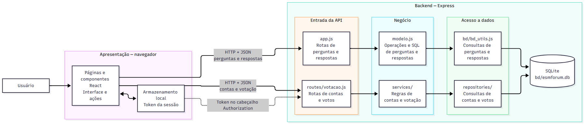

# Arquitetura atual do ESM Forum

## Organização do sistema

O ESM Forum funciona com uma aplicação React no navegador e uma API Express no backend. As duas aplicações são executadas separadamente. O navegador envia requisições HTTP para a API, que consulta ou altera os dados no SQLite e devolve respostas em JSON. Essa organização segue o estilo cliente-servidor.

Também há uma divisão em camadas, embora ela não seja igual em todas as funcionalidades. O código de contas e votação separa rotas, serviços e repositórios. O código de perguntas e respostas é mais direto: as rotas chamam o modelo, que contém as consultas SQL.

## Camadas

| Camada | Onde está | Responsabilidade |
| --- | --- | --- |
| Apresentação | Páginas e componentes React no frontend | Mostrar perguntas e respostas, receber ações do usuário e apresentar os resultados |
| Entrada da API | app.js e routes/votacao.js | Receber as requisições, ler os dados enviados e devolver as respostas HTTP |
| Negócio | modelo.js e services/ | Executar as operações de perguntas e respostas e aplicar as regras de contas e votação |
| Acesso a dados | bd/bd_utils.js e repositories/ | Executar as consultas e gravações no banco |
| Armazenamento | bd/esmforum.db | Guardar perguntas, respostas, usuários, sessões e votos |

Em perguntas e respostas, modelo.js reúne operações da aplicação e comandos SQL. Por isso, a separação entre negócio e acesso a dados é parcial nessa parte do sistema. Na votação, os serviços cuidam das regras e os repositórios ficam com as consultas ao banco.

## Comunicação entre frontend e backend

Durante o desenvolvimento, o React roda em localhost:3000 e a API em localhost:5000. O frontend faz chamadas HTTP para a API, enviando e recebendo JSON. Por exemplo, POST /perguntas envia uma pergunta, GET /respostas/:id_pergunta busca suas respostas e PUT /perguntas/:id/voto registra ou altera um voto. A API permite as chamadas feitas a partir da outra porta por meio de CORS.

Para votar, o frontend envia o token da sessão no cabeçalho Authorization. O token fica guardado no armazenamento local do navegador. A API identifica a sessão e consulta o banco antes de registrar o voto. A página recebe o resultado e atualiza o que é mostrado ao usuário.

## Diagrama

O diagrama mostra os dois caminhos usados pela API: perguntas e respostas passam pelo modelo; contas e votação passam pelos serviços e repositórios. Ambos chegam ao mesmo banco SQLite.

[Arquivo fonte do diagrama em Mermaid](diagramas/arquitetura_atual.mmd)