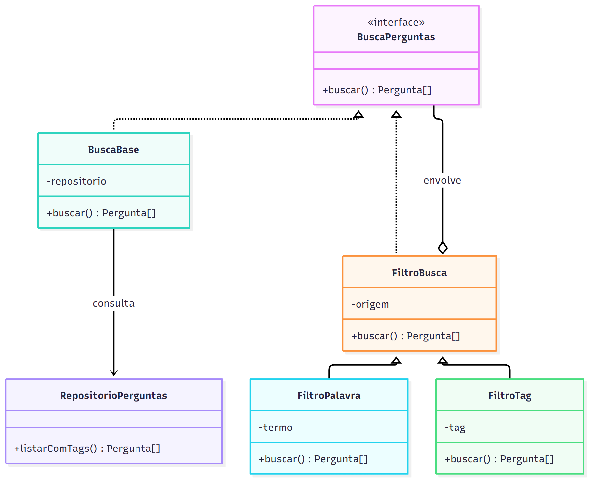
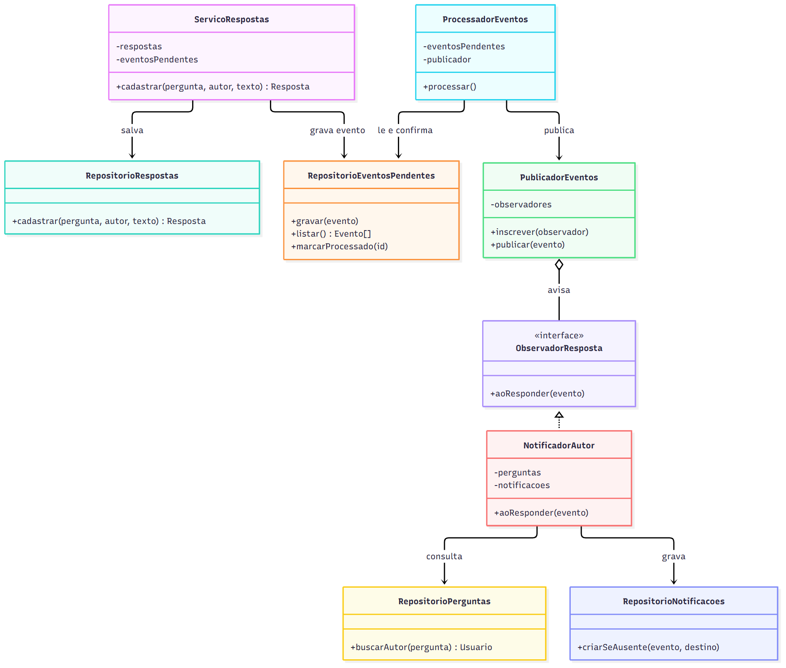
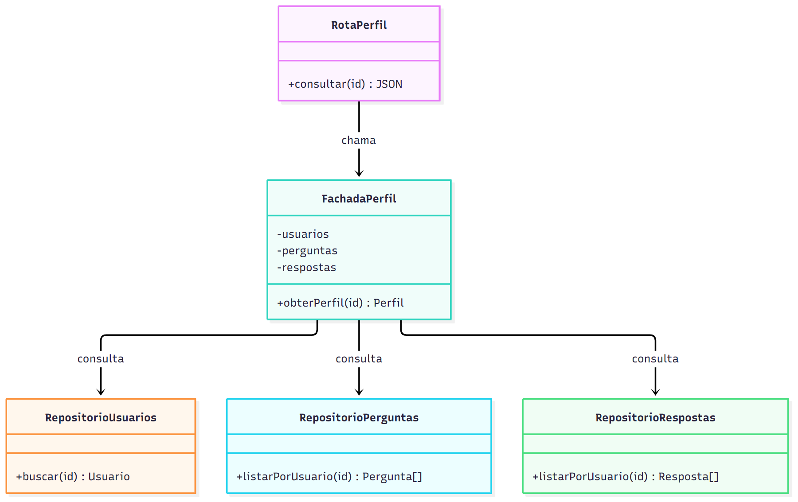

# Proposta de padrões de projeto

As propostas abaixo tratam de funcionalidades planejadas para o ESM Forum. A votação já foi implementada. Busca, tags, perfil e notificações ainda não fazem parte do sistema. Por isso, os módulos e os trechos de código desta página mostram como essas funções poderiam ser acrescentadas.

## 1. Decorator para busca e tags

A busca por palavra-chave e o filtro por tag podem ser usados separadamente ou juntos. Se cada combinação tiver sua própria função, a listagem precisará de caminhos diferentes para busca simples, filtro por tag e busca com filtro. Decorator permite montar a consulta com uma peça para cada filtro.

BuscaBase devolveria as perguntas, incluindo suas tags. FiltroPalavra receberia outra busca e manteria apenas as perguntas cujo texto contém o termo. FiltroTag receberia uma busca e manteria apenas as perguntas com a tag escolhida. Os dois filtros seguiriam o mesmo contrato, chamado BuscaPerguntas. Na rota, cada filtro seria acrescentado somente quando fosse pedido.

A tabela de perguntas já existe, mas ainda será necessário criar as tabelas de tags e da associação entre tag e pergunta. RepositorioPerguntas cuidaria dessa leitura. BuscaBase, FiltroPalavra e FiltroTag ficariam em módulos separados da pasta de busca. A rota só montaria os filtros e devolveria o resultado ao frontend.

Um exemplo simplificado da montagem:

```javascript
let busca = new BuscaBase(repositorioPerguntas);
if (termo) busca = new FiltroPalavra(busca, termo);
if (tag) busca = new FiltroTag(busca, tag);
const perguntas = busca.buscar();
```

Cada filtro chama buscar na busca recebida e filtra o resultado. Uma busca por termo e tag passa pelos dois filtros, na ordem em que foram montados. Uma pergunta sem tag ainda aparece quando não há filtro de tag. A busca por texto usa letras minúsculas dos dois lados para não distinguir maiúsculas de minúsculas.

Essa proposta combina bem com o uso dos dois recursos na mesma página. Para uma lista pequena, filtrar depois de carregar as perguntas é simples de entender. Se a lista crescer, o trabalho de filtrar deverá ir para o banco, sem perder a separação entre os critérios.



[Arquivo Mermaid do Decorator](diagramas/padrao_decorator.mmd)

## 2. Observer para novas respostas

Quando alguém responde a uma pergunta, o autor precisa ser avisado. O cadastro da resposta não precisa conhecer a regra de notificação. Com Observer, um publicador avisa os observadores inscritos sempre que há uma nova resposta.

ServicoRespostas salvaria a resposta pelo RepositorioRespostas. Na mesma transação, guardaria um evento no RepositorioEventosPendentes. Esse evento teria o identificador da pergunta, o da resposta e o do usuário que respondeu. A transação garante que uma resposta salva também deixe registrado o aviso que falta entregar.

ProcessadorEventos leria os eventos pendentes e os enviaria ao PublicadorEventos. NotificadorAutor seria um dos observadores inscritos. Ele buscaria o autor da pergunta e criaria a notificação pelo RepositorioNotificacoes. Se o autor da pergunta tiver escrito a resposta, não haveria notificação para ele. Depois de avisar os observadores, o processador marcaria o evento como concluído.

Os módulos novos seriam ServicoRespostas, RepositorioEventosPendentes, ProcessadorEventos, PublicadorEventos, NotificadorAutor e RepositorioNotificacoes. O cadastro atual de respostas não guarda o autor. Para esta proposta funcionar, a tabela de respostas teria de registrar id_usuario, e as respostas antigas precisariam de uma regra de migração.

O fluxo pode ser representado por este código simplificado:

```javascript
function cadastrarResposta(pergunta, autorResposta, texto) {
  return banco.transaction(() => {
    const resposta = repositorioRespostas.cadastrar(pergunta, autorResposta, texto);
    eventosPendentes.gravar({ pergunta, resposta: resposta.id_resposta, autorResposta });
    return resposta;
  })();
}

function processarEvento(evento) {
  publicador.publicar(evento);
  eventosPendentes.marcarProcessado(evento.id);
}

publicador.inscrever({
  aoResponder(evento) {
    const autorPergunta = repositorioPerguntas.buscarAutor(evento.pergunta);
    if (autorPergunta !== evento.autorResposta) {
      repositorioNotificacoes.criarSeAusente(evento.id, autorPergunta, evento.pergunta, evento.resposta);
    }
  }
});
```

Se a gravação da notificação falhar, o evento continua pendente para outra tentativa. criarSeAusente impediria que essa tentativa gerasse duas notificações iguais. Assim, a resposta permanece salva e o aviso pode ser concluído depois. Outros avisos ligados a novas respostas poderiam ser acrescentados pela inscrição de outro observador.



[Arquivo Mermaid do Observer](diagramas/padrao_observer.mmd)
## 3. Facade para o perfil do usuário

O perfil precisa juntar nome, perguntas e respostas de uma pessoa. Sem um ponto de entrada para essa operação, a rota teria de chamar vários módulos de dados e montar o resultado. Facade reúne essas chamadas em uma operação de perfil.

FachadaPerfil receberia RepositorioUsuarios, RepositorioPerguntas e RepositorioRespostas. Ao receber o identificador do usuário, buscaria a conta, a lista de perguntas e a lista de respostas. Se a conta não existir, devolveria um erro de usuário não encontrado. A rota GET /usuarios/:id/perfil chamaria apenas obterPerfil e devolveria o resultado em JSON.

O usuário já pode criar uma conta para votar. As perguntas antigas têm um id_usuario fixo, e as respostas ainda não guardam o autor. A associação entre essas publicações e as contas precisa ser resolvida antes de mostrar um histórico correto. Não seria adequado atribuir todas as perguntas antigas à primeira conta cadastrada só porque os identificadores coincidem.

Exemplo da operação proposta:

```javascript
function criarFachadaPerfil(usuarios, perguntas, respostas) {
  return {
    obterPerfil(id) {
      const usuario = usuarios.buscar(id);
      if (!usuario) throw new Error('Usuário não encontrado');
      return {
        usuario: { id_usuario: usuario.id_usuario, nome: usuario.nome },
        perguntas: perguntas.listarPorUsuario(id),
        respostas: respostas.listarPorUsuario(id)
      };
    }
  };
}
```

A fachada não substitui os repositórios. Ela organiza a operação que usa os três. A rota fica menor, e uma mudança na forma de buscar o histórico pode ficar dentro da fachada. O frontend receberia um único resultado para montar a página do perfil.



[Arquivo Mermaid do Facade](diagramas/padrao_facade.mmd)
