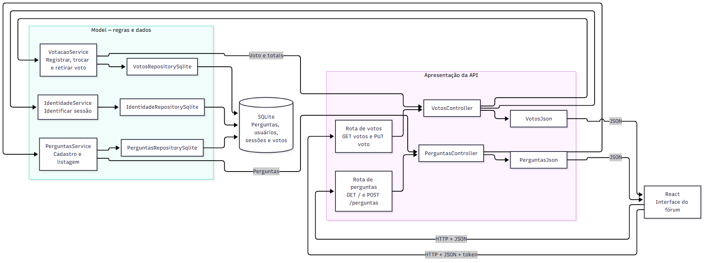

# Proposta de organização arquitetural

Hoje, as rotas de perguntas e respostas ficam em app.js, enquanto as consultas ao banco estão em modelo.js. A votação já tem arquivos separados para rotas, regras e acesso aos dados. A proposta é organizar as outras funções da mesma forma, mantendo os endereços que o frontend usa. A busca e as tags, previstas na Parte 2, seguiriam essa organização quando fossem implementadas.

## Separação em camadas

Na camada de apresentação ficariam as requisições HTTP. O arquivo app.js ficaria com a configuração do Express e o registro das rotas. Arquivos como routes/perguntas.js e routes/votos.js ligariam cada endereço ao controlador correspondente. PerguntasController leria o corpo de POST /perguntas. VotosController leria a ação enviada em PUT /perguntas/:id/voto e o usuário identificado pela sessão. Os controladores devolveriam as respostas em JSON. As consultas SQL e as regras dos votos ficariam em outras camadas.

A camada de negócio cuidaria das operações do fórum. PerguntasService cadastraria e listaria perguntas, verificando os dados necessários para o cadastro. RespostasService verificaria se a pergunta existe antes de salvar uma resposta. VotacaoService continuaria responsável por registrar, trocar ou retirar votos, usando as ações de votação já existentes. IdentidadeService continuaria cuidando de cadastro, entrada e sessão. Quando busca e tags forem feitas, BuscaPerguntasService reuniria os critérios recebidos da API e chamaria a consulta adequada. Os serviços chamariam os repositórios necessários para ler ou gravar dados.

Na camada de dados ficariam as consultas e gravações. PerguntasRepositorySqlite e RespostasRepositorySqlite assumiriam o SQL que hoje está em modelo.js. VotosRepositorySqlite e IdentidadeRepositorySqlite continuariam com os dados da votação e das contas. Cada repositório teria operações próprias, como buscar uma pergunta pelo identificador ou salvar um voto. A conexão SQLite ficaria em um módulo compartilhado de banco. Os serviços chamariam essas operações sem precisar conhecer os comandos SQL. O arquivo server.js montaria a aplicação com os repositórios SQLite.

O caminho das chamadas seria rota → controller → serviço → repositório → SQLite. A resposta voltaria pelo serviço e pelo controller até a view JSON, que definiria os campos enviados ao frontend. Uma alteração na consulta ficaria no repositório. Uma mudança nos campos enviados ao frontend ficaria na view JSON.

Os arquivos poderiam ficar assim:

~~~text
app.js
server.js
routes/
  perguntas.js
  respostas.js
  votos.js
  identidade.js
controllers/
  perguntas_controller.js
  respostas_controller.js
  votos_controller.js
  identidade_controller.js
services/
  perguntas_service.js
  respostas_service.js
  votacao.js
  identidade.js
  busca_perguntas_service.js       (quando a busca for implementada)
repositories/
  perguntas_sqlite.js
  respostas_sqlite.js
  votos_sqlite.js
  identidade_sqlite.js
views/
  perguntas_json.js
  respostas_json.js
  votos_json.js
  erros_json.js
bd/
  conexao.js
~~~

## MVC no backend

Nessa organização, Model é a parte que conhece os dados e as regras do fórum. Os serviços executariam as operações do Model e usariam os repositórios para salvar e buscar dados. A View montaria o JSON devolvido pela API. A tela continuaria no React. O Controller receberia a requisição, chamaria o serviço e escolheria o status HTTP. Os arquivos citados nesta seção fazem parte da proposta.

### Perguntas

Pergunta teria os dados id_pergunta, texto, id_usuario e num_respostas. PerguntasRepositorySqlite buscaria e salvaria perguntas. PerguntasService faria o cadastro e a listagem. Ao cadastrar, verificaria se o texto foi informado antes de pedir a gravação. No cadastro atual, id_usuario recebe sempre o valor 1. Para associar a pergunta ao autor correto, o serviço precisaria obter o usuário pela sessão.

PerguntasController atenderia GET / e POST /perguntas. Ele passaria os dados recebidos ao serviço e devolveria o status adequado. PerguntasJson montaria a lista com id_pergunta, texto e num_respostas, além da resposta do cadastro com id_pergunta. O frontend continuaria recebendo os campos que já usa. Para respostas, a mesma divisão caberia em RespostasController, RespostasService, RespostasRepositorySqlite e RespostasJson.

Na busca proposta para a Parte 2, GET / poderia aceitar um termo e uma tag como filtros. PerguntasController repassaria esses valores a BuscaPerguntasService. O serviço aplicaria os critérios, enquanto o repositório faria a consulta. As tags exigiriam suas próprias tabelas e um repositório para a associação com perguntas. A resposta JSON continuaria sendo uma lista de perguntas.

### Votação

Voto teria id_pergunta, id_usuario e valor. VotosRepositorySqlite manteria a leitura e a gravação dos votos. VotacaoService aplicaria as regras já implementadas: registrar voto positivo ou negativo, trocar o sentido do voto e retirar um voto existente. IdentidadeService identificaria o usuário pelo token da sessão. Essas regras ficariam fora do controller.

VotosController atenderia GET /perguntas/:id/votos e PUT /perguntas/:id/voto. No PUT, ele obteria o usuário da sessão, leria a ação do corpo da requisição e chamaria VotacaoService. VotosJson devolveria o total de votos e o voto do usuário no formato esperado pelo frontend. Se a sessão não existisse ou a ação fosse inválida, ErrosJson devolveria uma mensagem no campo erro. VotosController escolheria o status HTTP.

### Fluxo de uma votação

1. O usuário escolhe um voto no React. O frontend envia PUT /perguntas/:id/voto com a ação em JSON e o token da sessão no cabeçalho Authorization.
2. A rota chama VotosController. O controller pede a IdentidadeService que identifique o usuário e encaminha id da pergunta, id do usuário e ação para VotacaoService.
3. VotacaoService consulta o voto atual pelo VotosRepositorySqlite, aplica a ação escolhida e grava o resultado no SQLite. Depois consulta os totais atualizados.
4. VotosController passa o resultado para VotosJson. A API devolve o JSON ao frontend, que atualiza os números exibidos na pergunta.

O mesmo caminho vale para perguntas: a rota chama PerguntasController, o serviço executa a operação, o repositório acessa o SQLite e PerguntasJson formata a resposta.

## Diagrama da proposta

O diagrama mostra como perguntas e votação passariam pelas rotas, pelos controladores, pelos serviços e pelos repositórios. Também mostra as views que formatariam o JSON da resposta.

[Arquivo fonte Mermaid](diagramas/mvc_proposto.mmd)